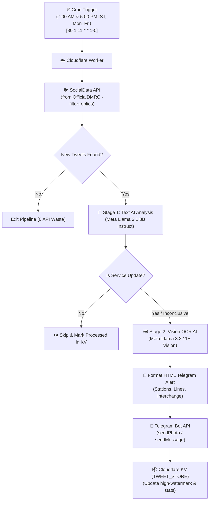

# 🚇 Delhi Metro Rail Corporation (DMRC) Service Update Telegram Bot

[](https://workers.cloudflare.com/)
[](https://developers.cloudflare.com/workers-ai/)
[](https://core.telegram.org/bots/api)
[](https://ai.meta.com/llama/)
[](LICENSE)

An automated, serverless notification system hosted on **Cloudflare Workers**. It monitors Delhi Metro Rail Corporation's official X/Twitter handle ([`@OfficialDMRC`](https://x.com/OfficialDMRC)), analyzes posts and official notice images using **Cloudflare Workers AI** (Meta Llama 3.1 Text + Meta Llama 3.2 Vision OCR), and broadcasts structured metro service updates directly to a **Telegram Bot**.

---

## 📑 Table of Contents

- [Architecture Overview](#-architecture-overview)
- [Key Features](#-key-features)
- [Two-Stage AI Pipeline](#-two-stage-ai-pipeline)
- [Noise Mitigation & Cursor Pagination](#-noise-mitigation--cursor-pagination)
- [Telegram Notification Examples](#-telegram-notification-examples)
- [Supported Service Update Categories](#-supported-service-update-categories)
- [Project Structure](#-project-structure)
- [Step-by-Step Installation & Deployment](#-step-by-step-installation--deployment)
- [REST API Endpoints & Monitoring](#-rest-api-endpoints--monitoring)
- [Resource & Cost Breakdown](#-resource--cost-breakdown)
- [Self-Healing & Reliability Mechanisms](#-self-healing--reliability-mechanisms)
- [License](#-license)

---

## 📐 Architecture Overview



---

## ✨ Key Features

- **⚡ Zero Server Cost ($0/month)**: Runs 100% inside free tiers of Cloudflare Workers, Workers AI, SocialData API, and Telegram.
- **🔍 API-Level Reply Filtering**: Queries `from:OfficialDMRC -filter:replies` to strip out customer service replies at the source.
- **📜 Multi-Page Cursor Pagination**: Follows `next_cursor` across up to 3 pages (~60 tweets) per check run to ensure no advisory tweets get skipped or buried.
- **🧠 Two-Stage AI Intelligence**:
  - **Stage 1 (Text Classification)**: `@cf/meta/llama-3.1-8b-instruct-fast` evaluates tweet text to detect station closures, line delays, speed restrictions, and service restorations.
  - **Stage 2 (Vision OCR)**: `@cf/meta/llama-3.2-11b-vision-instruct` scans official DMRC notice posters/infographics to extract affected stations, lines, interchange availability, and timing.
- **⏰ Smart Weekday Scheduling**: Triggered twice daily at **7:00 AM IST** and **5:00 PM IST** (Monday through Friday) using Cloudflare Cron Triggers (`30 1,11 * * 1-5`), using only ~44 API calls/month (out of 100 free requests).
- **📦 Distributed KV State Guard**: Uses Cloudflare KV (`TWEET_STORE`) with a 60-second distributed lock guard, high-watermark tweet ID tracking, and 7-day TTL deduplication logs.
- **📊 Real-Time Web Dashboard**: Built-in glassmorphic dark status dashboard served at `/` with DMRC metro line badges.

---

## 🧠 Two-Stage AI Pipeline

### Stage 1: Text Classification (Meta Llama 3.1 8B Instruct)
Determines whether tweet text represents an operational metro service update.

```json
{
  "is_service_update": true,
  "confidence": 0.95,
  "category": "Station Closure",
  "summary_en": "Multiple stations closed on Yellow and Violet lines till further instructions.",
  "affected_stations": ["Lok Kalyan Marg", "Rajiv Chowk", "Patel Chowk", "Mandi House"],
  "affected_lines": ["Yellow Line", "Violet Line"],
  "interchange_available": ["Rajiv Chowk", "Mandi House", "Central Secretariat"],
  "duration": "Till further instructions"
}
```

### Stage 2: Vision OCR (Meta Llama 3.2 11B Vision)
Triggered when tweets include notice images/infographics. Extracts full lists of closed stations, line names, and interchange facilities directly from image pixels.

---

## 🔍 Noise Mitigation & Cursor Pagination

DMRC's X handle (@OfficialDMRC) frequently posts passenger grievance responses. Without filtering, these replies cause API truncation and jump over actual service alerts.

- **Query Optimization**: `from:OfficialDMRC -filter:replies` eliminates 90%+ of reply noise at the API query level.
- **Pagination Loop**:
  ```javascript
  let cursor = null;
  let page = 0;
  const MAX_PAGES = 3;

  do {
    page++;
    let url = `https://api.socialdata.tools/twitter/search?query=${encodeURIComponent(query)}`;
    if (cursor) url += `&cursor=${encodeURIComponent(cursor)}`;

    const response = await fetchWithTimeout(url, { ... });
    const data = await response.json();
    allRawTweets.push(...(data.tweets || []));
    cursor = data.next_cursor || null;
  } while (cursor && page < MAX_PAGES);
  ```

---

## 📱 Telegram Notification Examples

When a service update is detected, the bot sends a formatted HTML alert:

```html
🚇 <b>DMRC SERVICE UPDATE</b>
━━━━━━━━━━━━━━━━━━━━

📋 <b>Category:</b> Station Closure
📅 <b>Date:</b> 22 Jul 2026, 11:27 AM IST

📝 <b>Summary:</b>
Below mentioned Metro stations have been closed till further instructions. Interchange facility shall remain available at Rajiv Chowk, Mandi House and Central Secretariat.

🚉 <b>Affected Stations:</b>
Lok Kalyan Marg, Rajiv Chowk, Patel Chowk, Ramakrishna Ashram Marg, Barakhambha Road, Supreme Court, Seva Teerth, Janpath, Mandi House, Central Secretariat, ITO, Delhi Gate, Indraprastha, Khan Market, Jor Bagh, Shivaji Stadium

🔀 <b>Interchange Available At:</b>
Rajiv Chowk, Mandi House, Central Secretariat

🚊 <b>Affected Lines:</b>
Yellow Line, Violet Line

💬 <b>Original Post:</b>
<blockquote>Service Update — Below mentioned Metro stations have been closed...</blockquote>

🔗 <a href="https://x.com/OfficialDMRC/status/2071913694569841036">View Post on X/Twitter</a>
```

---

## 🚇 Supported Service Update Categories

| Category | Example Tweet Content |
|----------|-----------------------|
| **Station Closure** | *"Metro stations have been closed till further instructions..."* |
| **Service Delay** | *"Minor delay on Blue Line due to a signalling issue..."* |
| **Line Suspension** | *"Services not available between Sultanpur and HUDA City Centre..."* |
| **Speed Restriction** | *"Speed restriction in place between Rajiv Chowk and Kashmere Gate..."* |
| **Service Restoration** | *"All stations of the Delhi Metro network are now open for passenger services."* |
| **Security Alert** | *"Entry/exit gates at Rajiv Chowk closed due to security reasons..."* |
| **Gate Closure** | *"Gate No. 3 & 4 of Mandi House station closed..."* |
| **Timing Change** | *"Last metro service extended by 30 minutes for IPL match..."* |

---

## 🛠️ Project Structure

```
dmrc-telegram-bot/
├── src/
│   ├── index.js          # Worker entrypoint (Cron handler + HTTP endpoints)
│   ├── twitter.js        # Twitter client using SocialData API (-filter:replies + pagination)
│   ├── analyzer.js       # Cloudflare Workers AI (Llama 3.1 & Llama 3.2 Vision)
│   ├── telegram.js       # Telegram Bot API client with retry & HTML support
│   ├── formatter.js      # HTML message formatter with metro theming
│   ├── dashboard.js      # Glassmorphic web status dashboard
│   └── utils.js          # Shared utilities (fetchWithTimeout, parseBoolean)
├── wrangler.toml         # Cloudflare Worker configuration & bindings
├── package.json          # Node dependencies & scripts
├── .dev.vars             # Local environment secrets (ignored by git)
├── .dev.vars.example     # Local secrets template
├── .gitignore            # Security exclusions
├── LICENSE               # MIT License
└── README.md             # Complete documentation
```

---

## 🚀 Step-by-Step Installation & Deployment

### Prerequisites
- [Node.js](https://nodejs.org/) (v18 or higher)
- [Cloudflare Account](https://dash.cloudflare.com/) (Free Tier)
- Telegram Bot token from [@BotFather](https://t.me/BotFather)
- API Key from [SocialData.tools](https://socialdata.tools)

### Step 1: Clone Repository
```bash
git clone https://github.com/ChainiKhaini/dmrc-telegram-bot-.git
cd dmrc-telegram-bot-
npm install
```

### Step 2: Create Cloudflare KV Namespace
```bash
npx wrangler kv namespace create TWEET_STORE
```
Copy the returned ID into `wrangler.toml`:
```toml
[[kv_namespaces]]
binding = "TWEET_STORE"
id = "1e37b44426b94e2fa8de2bccfe7a38da"
```

### Step 3: Configure Cloudflare Secrets
```bash
npx wrangler secret put SOCIALDATA_API_KEY
npx wrangler secret put TELEGRAM_BOT_TOKEN
npx wrangler secret put TELEGRAM_CHAT_ID
```

### Step 4: Local Testing
```bash
# 1. Create .dev.vars file
echo 'SOCIALDATA_API_KEY="your_key"' > .dev.vars
echo 'TELEGRAM_BOT_TOKEN="your_token"' >> .dev.vars
echo 'TELEGRAM_CHAT_ID="your_chat_id"' >> .dev.vars

# 2. Run local server
npm run dev
```

### Step 5: Deploy to Production
```bash
npm run deploy
```

---

## 📊 REST API Endpoints & Monitoring

The Worker exposes production management endpoints:

| Endpoint | Method | Description |
|----------|--------|-------------|
| `/` or `/dashboard` | `GET` | HTML status dashboard with live metrics & metro line badges |
| `/health` | `GET` | System health check (returns `{ "status": "ok" }`) |
| `/stats` | `GET` | Metrics (total checked, updates sent, API hits) — requires secret |
| `/trigger` | `POST` | Manually triggers the AI pipeline on-demand — requires secret |

---

## 💡 Resource & Cost Breakdown

| Service | Free Plan Limit | Project Usage | Monthly Cost |
|---------|-----------------|---------------|--------------|
| **Cloudflare Workers** | 100,000 req/day | ~2 requests/day | **$0.00** |
| **Cloudflare Workers AI** | 10,000 neurons/day | ~200 neurons/day | **$0.00** |
| **Cloudflare KV** | 100,000 reads/day | ~44 reads/day | **$0.00** |
| **SocialData API** | 100 req/month free | ~44 requests/month | **$0.00** |
| **Telegram Bot API** | Unlimited | ~5–15 msgs/day | **$0.00** |
| **Total Cost** | | | **$0.00 / month** |

---

## 🛡️ Self-Healing & Reliability Mechanisms

1. **Distributed Lock Guard**: Cloudflare KV lock (`lock:pipeline`) with 60-second TTL prevents concurrent cron executions.
2. **Model Failover Chain**: Tries primary model (`llama-3.1-8b-instruct-fast`), falling back to alternative variants if Cloudflare AI model endpoints experience temporary outages.
3. **Keyword Heuristic Fallback**: If all AI models fail, a deterministic keyword matcher evaluates tweet text to ensure critical service announcements are never lost.
4. **Telegram Exponential Backoff**: Handles HTTP 429 rate limits by respecting Telegram's `retry_after` parameters up to 3 automatic retries.
5. **Message Truncation Guard**: Ensures Telegram HTML messages never exceed Telegram's 4,096-character API limit.

---

## 📄 License

This project is licensed under the [MIT License](LICENSE).
