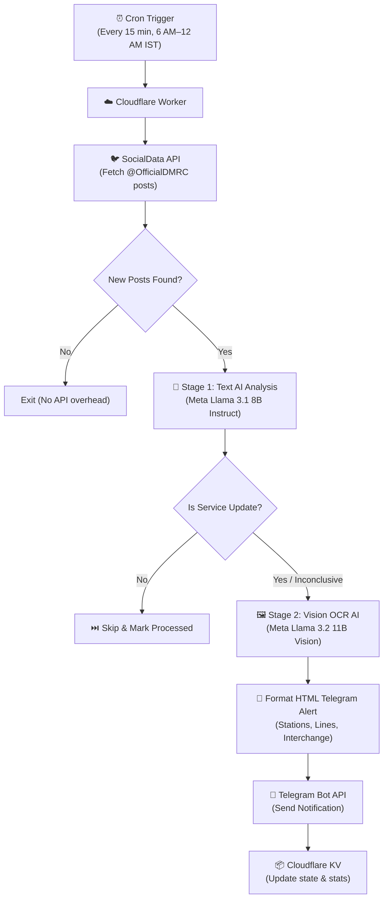

# 🚇 Delhi Metro Rail Corporation (DMRC) Service Update Telegram Bot

[](https://workers.cloudflare.com/)
[](https://developers.cloudflare.com/workers-ai/)
[](https://core.telegram.org/bots/api)
[](https://ai.meta.com/llama/)
[](LICENSE)

An automated, serverless notification system hosted on **Cloudflare Workers**. It monitors Delhi Metro Rail Corporation's official X/Twitter handle ([`@OfficialDMRC`](https://x.com/OfficialDMRC)), analyzes posts and official notice images using **Cloudflare Workers AI** (Meta Llama 3.1 Text + Meta Llama 3.2 Vision OCR), and broadcasts structured metro service updates directly to a **Telegram Bot**.

---

## 📐 Architecture Overview



---

## ✨ Key Features

- **⚡ Zero Server Cost ($0/month)**: Operates 100% within the free tiers of Cloudflare Workers, Cloudflare Workers AI, SocialData API, and Telegram.
- **🔍 Reply Filtering & Multi-Page Cursor Pagination**: Automatically queries `from:OfficialDMRC -filter:replies` to strip out customer service replies at the API layer, and follows `next_cursor` pagination across up to 3 pages (~60 tweets) per check to prevent high-volume reply spams from burying service update notices.
- **🧠 Two-Stage AI Analysis Pipeline**:
  - **Stage 1 (Text Classification)**: Uses `@cf/meta/llama-3.1-8b-instruct-fast` to evaluate tweet text and filter out non-service-update posts (promotional content, greetings, recruitment).
  - **Stage 2 (Vision OCR)**: Uses `@cf/meta/llama-3.2-11b-vision-instruct` to scan official DMRC notice images and extract structured data: affected stations, metro lines, interchange availability, and timing.
- **⏰ High-Frequency Monitoring**: Triggered every **15 minutes** during Delhi Metro operating hours (6:00 AM – 11:45 PM IST) using Cloudflare Cron Triggers, ensuring near-real-time service alert delivery.
- **📦 State Management & Deduplication**: Employs Cloudflare KV (`TWEET_STORE`) to track processed tweet IDs and maintain deduplication logs with 7-day TTL expiration.
- **🛠️ Self-Healing Error Handling**: Automatic model failovers, keyword heuristics fallbacks, and exponential backoff retry logic for API rate limits.
- **🚊 Metro Line Awareness**: Classifies updates by category — Station Closure, Service Delay, Line Suspension, Speed Restriction, Service Restoration, Security Alert.

---

## 📱 Telegram Alert Preview

When a service update is detected, the bot delivers a formatted HTML message:

```
🚇 DMRC SERVICE UPDATE
━━━━━━━━━━━━━━━━━━━━

📋 Category: Station Closure
📅 Date: 22 Jul 2026, 11:27 AM IST

📝 Summary:
Below mentioned Metro stations have been closed till further
instructions. Interchange facility shall remain available at
Rajiv Chowk, Mandi House and Central Secretariat.

🚉 Affected Stations:
Lok Kalyan Marg, Rajiv Chowk, Patel Chowk, Ramakrishna Ashram
Marg, Barakhambha Road, Supreme Court, Seva Teerth, Janpath,
Mandi House, Central Secretariat, ITO, Delhi Gate, Indraprastha,
Khan Market, Jor Bagh, Shivaji Stadium

🔀 Interchange Available At:
Rajiv Chowk, Mandi House, Central Secretariat

🚊 Affected Lines:
Yellow Line, Violet Line

💬 Original Post:
"Service Update — Below mentioned Metro stations have been..."

🔗 View Post on X/Twitter
```

---

## 🛠️ Project Structure

```
dmrc-telegram-bot/
├── src/
│   ├── index.js          # Worker entrypoint (Cron handler + HTTP endpoints)
│   ├── twitter.js        # Twitter client using SocialData API
│   ├── analyzer.js       # Cloudflare Workers AI (Llama 3.1 & Llama 3.2 Vision)
│   ├── telegram.js       # Telegram Bot API client with retry & HTML support
│   ├── formatter.js      # HTML message formatter with metro theming
│   ├── dashboard.js      # Web status dashboard
│   └── utils.js          # Shared utilities (fetchWithTimeout, parseBoolean)
├── wrangler.toml         # Cloudflare Worker configuration & bindings
├── package.json          # Node dependencies & scripts
├── .dev.vars.example     # Local secrets template
├── .gitignore            # Security exclusions
└── README.md             # This file
```

---

## 🚀 Step-by-Step Installation & Deployment

### Prerequisites

- [Node.js](https://nodejs.org/) (v18 or higher)
- A free [Cloudflare Account](https://dash.cloudflare.com/)
- A Telegram Bot token from [@BotFather](https://t.me/BotFather)
- An API Key from [SocialData.tools](https://socialdata.tools)

### Step 1: Clone the Repository

```bash
git clone https://github.com/ChainiKhaini/dmrc-telegram-bot.git
cd dmrc-telegram-bot
npm install
```

### Step 2: Create Cloudflare KV Namespace

Run Wrangler CLI to create the state storage namespace:

```bash
npx wrangler kv namespace create TWEET_STORE
```

Copy the returned namespace `id` and update `wrangler.toml`:

```toml
[[kv_namespaces]]
binding = "TWEET_STORE"
id = "YOUR_KV_NAMESPACE_ID"
```

### Step 3: Configure Cloudflare Secrets

Store your sensitive API keys securely:

```bash
# 1. SocialData API Key
npx wrangler secret put SOCIALDATA_API_KEY

# 2. Telegram Bot Token (from @BotFather)
npx wrangler secret put TELEGRAM_BOT_TOKEN

# 3. Telegram Chat ID (your user ID or channel handle)
npx wrangler secret put TELEGRAM_CHAT_ID
```

### Step 4: Local Development & Testing

1. Create a `.dev.vars` file for local secrets:
   ```ini
   SOCIALDATA_API_KEY="your_api_key_here"
   TELEGRAM_BOT_TOKEN="your_bot_token_here"
   TELEGRAM_CHAT_ID="your_chat_id_here"
   ```
2. Start the local development server:
   ```bash
   npm run dev
   ```

### Step 5: Deploy to Production

Deploy the Worker to Cloudflare's edge network:

```bash
npm run deploy
```

Wrangler will output your deployed Worker URL: `https://dmrc-telegram-bot.<your-subdomain>.workers.dev`

---

## 📊 Monitoring & REST Endpoints

The worker exposes HTTP management endpoints:

| Endpoint | Method | Description |
|----------|--------|-------------|
| `/` | `GET` | Rich HTML status dashboard with metro theming |
| `/health` | `GET` | System health check with timestamp |
| `/stats` | `GET` | Metrics (tweets checked, updates sent, run counts) — requires auth |
| `/trigger` | `POST` | Manually triggers the AI pipeline on-demand — requires auth |

#### Example Usage:
```bash
# Check health
curl https://dmrc-telegram-bot.<your-subdomain>.workers.dev/health

# View dashboard
open https://dmrc-telegram-bot.<your-subdomain>.workers.dev/

# Trigger manual check (with auth)
curl -X POST -H "X-Trigger-Secret: YOUR_SECRET" \
  https://dmrc-telegram-bot.<your-subdomain>.workers.dev/trigger
```

---

## 🚇 Supported DMRC Service Update Categories

| Category | Example |
|----------|---------|
| **Station Closure** | "Metro stations have been closed till further instructions" |
| **Service Delay** | "Minor delay on Blue Line due to a signalling issue" |
| **Line Suspension** | "Services not available between Sultanpur and HUDA City Centre" |
| **Speed Restriction** | "Speed restriction in place between Rajiv Chowk and Kashmere Gate" |
| **Service Restoration** | "All stations of the Delhi Metro network are now open" |
| **Security Alert** | "Entry/exit gates at Rajiv Chowk closed due to security reasons" |
| **Gate Closure** | "Gate No. 3 & 4 of Mandi House station closed" |
| **Timing Change** | "Last metro service extended by 30 minutes" |

---

## 💡 Resource & Cost Analysis

| Service | Free Plan Limit | Project Usage | Monthly Cost |
|---------|-----------------|---------------|--------------|
| **Cloudflare Workers** | 100,000 req/day | ~72 requests/day | **$0.00** |
| **Cloudflare Workers AI** | 10,000 neurons/day | ~500 neurons/day | **$0.00** |
| **Cloudflare KV** | 100,000 reads/day | ~150 reads/day | **$0.00** |
| **SocialData API** | 100 req/month free | ~72 requests/month | **$0.00** |
| **Telegram Bot API** | Unlimited | ~10–30 msgs/day | **$0.00** |
| **Total Cost** | | | **$0.00 / month** |

---

## 📄 License

This project is licensed under the [MIT License](LICENSE).
